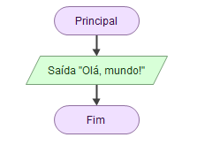
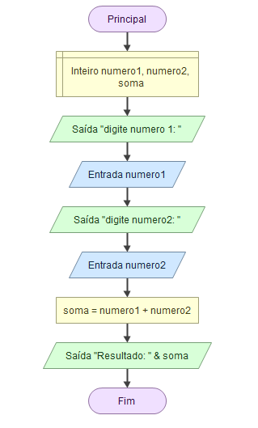

# 🧠 O que é um Fluxograma?

Um **fluxograma** é um **desenho que representa o passo a passo de um algoritmo**. Ele mostra o que o programa faz de forma **visual**, com **setas e blocos**.

> É como um mapa que o computador segue para resolver um problema.

---

## 💻 O que é o **Flowgorithm**?

O **Flowgorithm** é um programa gratuito que permite criar fluxogramas de forma fácil e interativa.

✅ Ideal para quem está começando  
✅ Interface com **blocos coloridos e setas**  
✅ Pode **executar o algoritmo passo a passo**  
✅ Mostra o **código gerado automaticamente** (em Python, Java, etc.)

---

# 🧩 Elementos principais do Fluxograma no Flowgorithm

| Ícone        | Nome                     | Para que serve                                  |
|-------------|--------------------------|-------------------------------------------------|
| 🔷 Oval      | Início / Fim              | Marca o começo ou o fim do algoritmo            |
| 🟦 Paralelogramo | Entrada / Saída          | Usado para **ler** valores e **mostrar** mensagens |
| 🟩 Retângulo | Atribuição / Processo     | Usado para fazer cálculos ou guardar valores    |
| 🔺 Losango   | Decisão (`Se`, `Senão`)   | Usado para fazer **perguntas** (condições)      |
| 🔁 Setas     | Conectam os blocos       | Mostram a **ordem do fluxo** do programa        |

---

## ✏️ Algoritmo que mostra "Olá, mundo!"

### 🔢 Passos:
1. Início  
2. Mostrar a mensagem "Olá, mundo!"  
3. Fim

### 🖼️ Como montar no Flowgorithm:
1. Clique no **bloco azul (Saída)**  
2. Digite:  
   ```
   "Olá, mundo!"
   ```
3. Clique com o botão direito no fim e selecione **Encerrar programa**



✅ Pronto! Você fez seu primeiro fluxograma!

---

## 🧮 Exemplo 2 – Somar dois números

### 🔢 Passos:
1. Início  
2. Ler dois números  
3. Calcular a soma  
4. Mostrar o resultado  
5. Fim

### 🧰 Blocos no Flowgorithm:
- 🟦 Entrada:  
  ```plaintext
  Leia numero1
  Leia numero2
  ```
- 🟩 Processo:  
  ```plaintext
  soma <- numero1 + numero2
  ```
- 🟦 Saída:  
  ```plaintext
  Escreva "Resultado: ", soma
  ```

---

## ✅ Exemplo com Decisão – Verificar se é maior de idade

### 🔢 Algoritmo:
1. Início  
2. Ler idade  
3. Se idade ≥ 18  
   - Mostrar "Maior de idade"  
   - Senão, mostrar "Menor de idade"  
4. Fim

### 🔺 Bloco de Decisão:
- Condição:
  ```plaintext
  idade >= 18
  ```

- **Caminho Sim:**  
  Saída: `"Maior de idade"`

- **Caminho Não:**  
  Saída: `"Menor de idade"`


---

## 🔁 Exemplo com Repetição – Contar de 1 até 5

### Algoritmo:
1. Início  
2. Para i de 1 até 5  
   - Mostrar i  
3. Fim

### Blocos no Flowgorithm:
- 🟩 Processo: `i <- 1`  
- 🔁 Use o laço (For/Enquanto)  
- 🟦 Saída: `Escreva i`

---

## 🛠️ Dica: Como configurar o Flowgorithm em português

1. Vá em **Tools (Ferramentas)** → **Language** → Selecione **Português**  
2. Os blocos e mensagens ficarão em português  
3. As palavras-chave também mudam (`Escreva`, `Leia`, `Se`, etc.)

